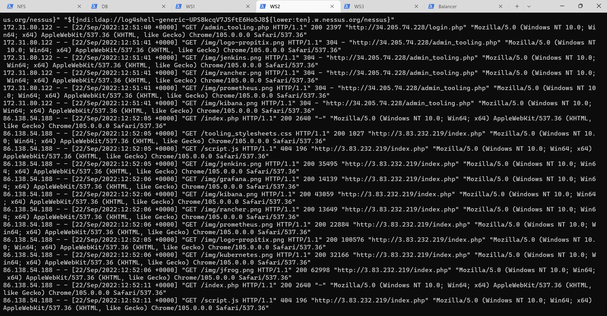

# Project 8: Load Balancer Solution With Apache

## Configure Apache As A Load Balancer

First create an Ubuntu Server 20.04 EC2 instance and name it Project-8-apache-lb, so your EC2 list will look like this:

Open TCP port 80 on Project-8-apache-lb by creating an Inbound Rule in Security Group:

Next is to install Apache Load Balancer on Project-8-apache-lb server and configure it to point traffic coming to LB to both Web Servers:

Install Apache:

`sudo apt update`
`sudo apt install apache2 -y`
`sudo apt-get install libxml2-dev`

Enable modules:

`sudo a2enmod rewrite`
`sudo a2enmod proxy`
`sudo a2enmod proxy_balancer`
`sudo a2enmod proxy_http`
`sudo a2enmod headers`
`sudo a2enmod lbmethod_bytraffic`

Restart apache2 service:

`sudo systemctl restart apache2`

`sudo systemctl status apache2`

Configure load balancing:

`sudo vi /etc/apache2/sites-available/000-default.conf`

Add this configuration into this section <VirtualHost *:80> :

<!-- <Proxy "balancer://mycluster">
               BalancerMember http://<WebServer1-Private-IP-Address>:80 loadfactor=5 timeout=1
               BalancerMember http://<WebServer2-Private-IP-Address>:80 loadfactor=5 timeout=1
               ProxySet lbmethod=bytraffic
               # ProxySet lbmethod=byrequests
        </Proxy>

        ProxyPreserveHost On
        ProxyPass / balancer://mycluster/
        ProxyPassReverse / balancer://mycluster/ -->

Restart apache server:

`sudo systemctl restart apache2`

Verify that our configuration works – try to access your LB’s public IP address or Public DNS name from your browser:

`http://<Load-Balancer-Public-IP-Address-or-Public-DNS-Name>/index.php`

Open two ssh/Putty consoles for both Web Servers and run following command:

`sudo tail -f /var/log/httpd/access_log`

Try to refresh your browser page http://<Load-Balancer-Public-IP-Address-or-Public-DNS-Name>/index.php several times and make sure that both servers receive HTTP GET requests from your LB – new records must appear in each server’s log file as shown in the image:

## Configure Local DNS Names Resolution

Configure the file /etc/hosts:

`sudo vi /etc/hosts`

Add 2 records into this file with Local IP address and arbitrary name for both of your Web Servers

<WebServer1-Private-IP-Address> web2
<WebServer2-Private-IP-Address> web3

Now you can update your LB config file with those names instead of IP addresses:

BalancerMember http://web2:80 loadfactor=5 timeout=1
BalancerMember http://web3:80 loadfactor=5 timeout=1

Try to curl your Web Servers from LB locally 'curl http://web2 or curl http://web3 – it shall work:

This is only a local configuration

